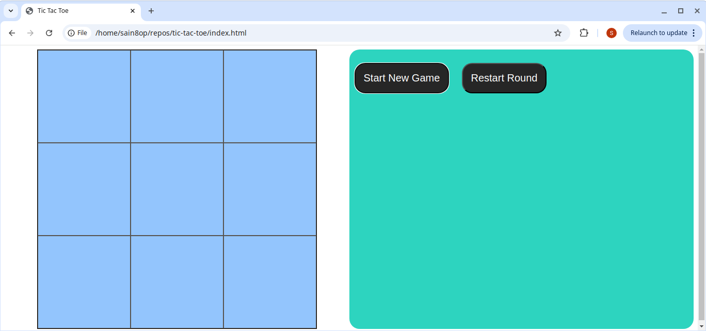
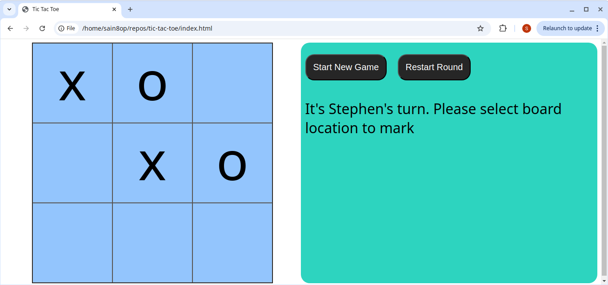
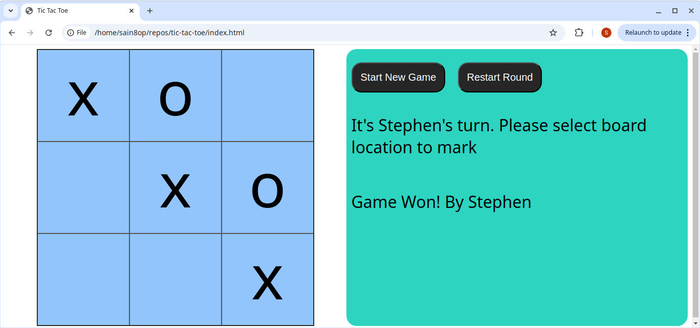
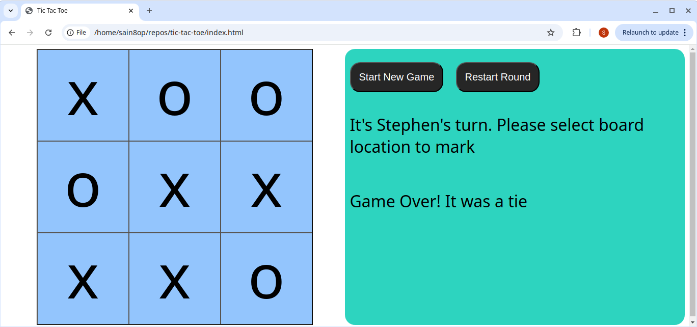
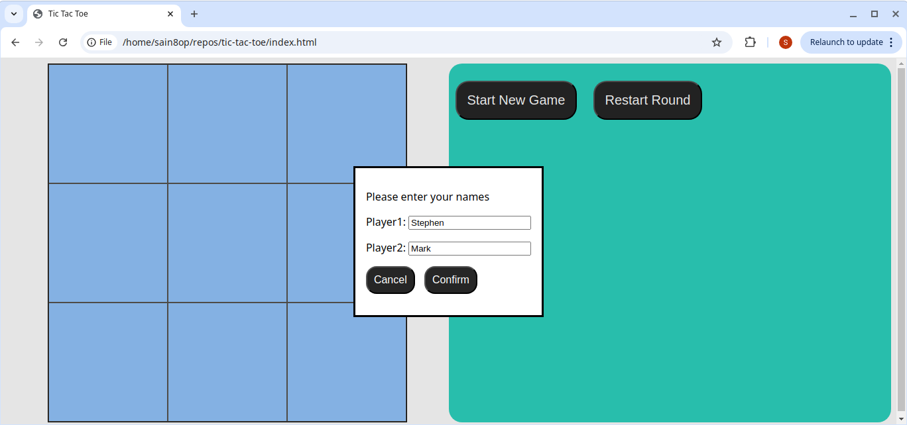
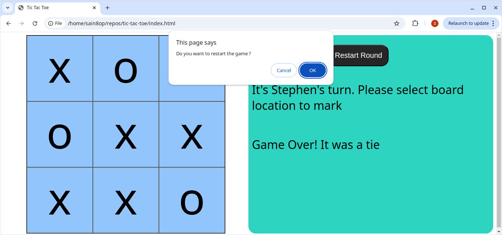

# TIC-TAC-TOE

## Table of Contents
- [Introduction](#introduction)
- [Features](#features)
- [How to Play](#how-to-play)
- [Screenshots](#screenshots)
- [Technologies Used](#technologies-used)
- [Lessons Learned](#lessons-learned)
- [Challenges Faced](#challenges-faced)
- [Future Improvements](#future-improvements)
- [Acknowledgments](#acknowledgments)

## Introduction
A browser-based Tic Tac Toe game built using JavaScript, HTML, and CSS. This project is part of my learning journey through The Odin Project curriculum, demonstrating modular programming, event handling, and game logic.

## Features
- Two-player mode with customizable player names.
- Dynamic gameboard using modular JavaScript.
- Displays turn-by-turn updates.
- Detects win conditions and announces the winner or a tie.
- Allows restarting the current round or starting a new game with different players.

## How to Play
1. Click the Start New Game button.
2. Enter player names in the dialog box and click Confirm.
3. Players take turns marking spots on the grid until a winner is determined or the game ends in a tie.
4. Use the Restart Round button to replay the current round, or click Start New Game to reset everything.

## Screenshots

### Game Start

*An empty board ready for players to begin.*

### Mid-Game Progress

*Players in the middle of the game.*

### Game Win

*A winning scenario with a congratulatory message.*

### Tie Game

*The game ends in a draw.*

### Buttons in Action

*The functional "Start New Game" and "Restart Round" buttons.*

## Technologies Used
- **HTML:** For structure.
- **CSS:** For styling and layout.
- **JavaScript:** for game logic and interactivity.

## Lessons Learned
While building this project, I:

- Mastered JavaScript modules, factory functions, and IIFE patterns.
- Improved my ability to manage event listeners effectively.
- Learned to implement game logic for turn-based interactions, win conditions, and state management.

## Challenges Faced

1. Event Listener Complexity
- Managing and clearing event listeners for the gameboard was a tricky part of the project. It took significant effort to ensure smooth functionality during game restarts.

2. Restart Logic
- Implementing seamless transitions between game states required careful refactoring of the code.

## Future Improvements
- Add animations for a more interactive user experience.
- Implement responsive design to make the game playable on mobile devices.

## Acknowledgments
This project was built as part of The Odin Project curriculum.